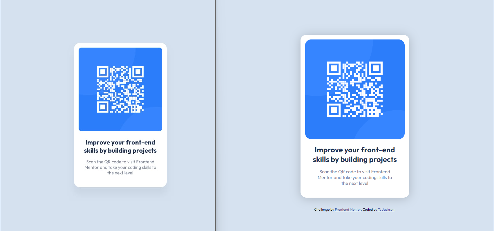

# Frontend Mentor - QR code component solution

This is a solution to the [QR code component challenge on Frontend Mentor](https://www.frontendmentor.io/challenges/qr-code-component-iux_sIO_H). Frontend Mentor challenges help you improve your coding skills by building realistic projects. 

## Table of contents

- [Overview](#overview)
  - [Screenshot](#design-vs-my-build)
  - [Links](#links)
- [My process](#my-process)
  - [Built with](#built-with)
  - [What I learned](#what-i-learned)
  - [Continued development](#continued-development)
  - [Useful resources](#useful-resources)
- [Author](#author)

## Overview

This is my first project with Fronted Mentor. I have no idea what I'm doing. Time for research!

### Design vs My Build

### Links

- Solution URL: [https://github.com/TJRelly/QR-code-component](https://github.com/TJRelly/QR-code-component)
- Live Site URL: [https://tjrelly.github.io/QR-code-component](https://tjrelly.github.io/QR-code-component/)

## My process

### Built with

- Semantic HTML5 markup
- CSS custom properties
- Flexbox
- Mobile-first workflow

### What I learned

I learned that something as simple as a period (".") can break a link.
I learned about the necessity of using git pull.

### Continued development

This project has inspired me to improve my knowlege of CSS and Flexbox.

### Useful resources

- [Example resource 1](https://www.youtube.com/watch?v=JqJNhM8i-nc&t=1s) - This helped me review my knowledge of Flexbox. 

## Author

<!-- - Website - [Add your name here](https://www.your-site.com) -->
- Frontend Mentor - [@TJRelly](https://www.frontendmentor.io/profile/TJRelly)
- Twitter - [@TJR_Tech](https://www.twitter.com/TJR_Tech)

